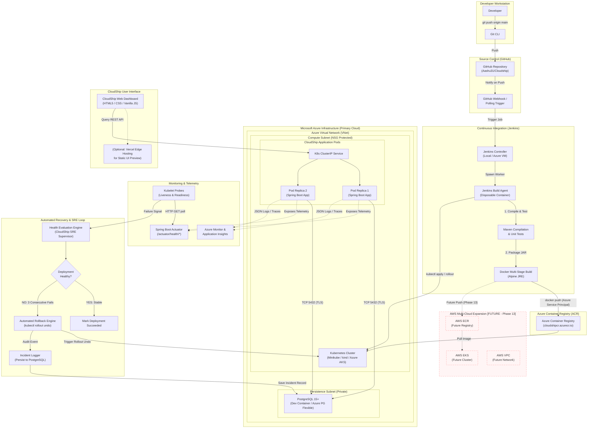
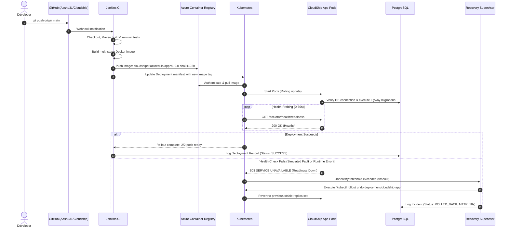

# CloudShip — Architecture Diagrams (Azure-First)

**Document Version:** 1.1.0  
**Phase:** Phase 0 (Foundation & Architecture)  
**Status:** Approved  

---

## 1. End-to-End System Architecture (Primary: Azure)

This diagram illustrates the primary operational workflow from code commit through CI/CD, Azure Container Registry, Azure cloud orchestration, observability, and automated recovery loops, alongside the future multi-cloud boundary.

---

## 2. Component Interaction & Sequence Flow

