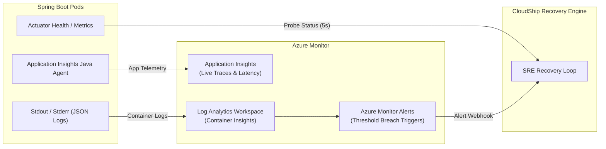

# CloudShip — Observability, Telemetry & Incident Taxonomy (Azure-First)

**Document Version:** 1.1.0  
**Phase:** Phase 0 (Foundation & Architecture)  
**Status:** Approved  

---

## 1. Observability Pillars & Taxonomy

CloudShip structures telemetry into five distinct operational abstractions:

```text
┌─────────────────────────────────────────────────────────────────────────┐
│                          Observability Taxonomy                         │
├──────────────┬──────────────────────────────────────────────────────────┤
│ Logs         │ Discrete, timestamped event records emitted by workloads │
│ Metrics      │ Aggregable numerical measurements evaluated over time    │
│ Health Checks│ Binary or stateful runtime availability indicators       │
│ Alerts       │ Actionable notifications triggered when thresholds cross │
│ Incidents    │ Auditable operational records of degradation & recovery  │
└──────────────┴──────────────────────────────────────────────────────────┘
```

### 1.1 Taxonomy Concepts Comparison

| Concept | Nature | Typical Source | Retention | Example |
|---|---|---|---|---|
| **Logs** | JSON text streams | Container stdout/stderr, Logback | 30 days (Azure Log Analytics) | `{"level":"ERROR","msg":"DB connection refused"}` |
| **Metrics** | Time-series float vectors | Actuator `/metrics`, Azure Monitor | 30 days | `http_server_requests_seconds_count{status="500"}` |
| **Health Checks** | Structured status (`UP`/`DOWN`) | Actuator `/health`, K8s Liveness/Readiness | Current State | `GET /actuator/health/readiness -> 200 OK` |
| **Alerts** | State transitions with severity | Azure Monitor Metric Alerts | Ephemeral (until resolved) | `Alert: DeploymentRolloutStalled (Severity: 1)` |
| **Incidents** | Relational database entity | CloudShip SRE Supervisor | Permanent (PostgreSQL) | `Incident #42: Pod crash loop -> Auto-rollback to v1.2` |

---

## 2. Core Metrics Monitored by CloudShip

### 2.1 Application & Runtime Telemetry
- **HTTP Request Rate & Status Codes**: Rates of `2xx`, `4xx`, and `5xx` responses (RED method).
- **Latency Distribution**: Request latency p50, p95, and p99.
- **JVM Heap & Non-Heap Memory**: Committed vs. used memory; garbage collection pause times.
- **Database Connection Pool (HikariCP)**: Active connections, idle connections, acquisition latency.

### 2.2 Container & Kubernetes Telemetry
- **CPU & Memory Utilization**: Pod CPU millicores and memory consumption compared against requests/limits.
- **Pod Lifecycle State**: `Pending`, `Running`, `CrashLoopBackOff`, `Completed`.
- **Container Restart Count**: Consecutive or cumulative container terminations.
- **Replica Availability**: Available replicas vs. desired replica count (`status.availableReplicas / spec.replicas`).

### 2.3 Deployment Pipeline Telemetry (DORA Metrics)
- **Deployment Duration**: Wall-clock time elapsed from trigger dispatch to all replicas reaching ready state.
- **Deployment Frequency**: Count of deployments executed per day/week.
- **Change Failure Rate**: Percentage of deployments requiring rollback or hotfix intervention.
- **Rollback Count**: Total frequency of automated or manual rollbacks.

### 2.4 Reliability & Recovery Telemetry
- **Mean Time to Detect (MTTD)**: Time from fault injection to first probe failure detection.
- **Mean Time to Recovery (MTTR)**: Time from confirmed failure detection to completed rollback and healthy status restoration.
- **Total Incident Count**: Cumulative count of recovered service degradations.

---

## 3. Microsoft Azure Monitoring Architecture



---

## 4. Phased Telemetry Implementation Roadmap

- **Phase 0 (Active)**: Observability taxonomy and telemetry metrics defined.
- **Phase 1**: Spring Boot Actuator health groups (`liveness`, `readiness`) and structured logging.
- **Phase 6**: Kubernetes pod health probes and container restart counters active.
- **Phase 9**: Azure Monitor Log Analytics workspace and Application Insights agent integration.
- **Phase 12**: Automated SRE recovery engine actively evaluating probe metrics to trigger self-healing rollbacks.
